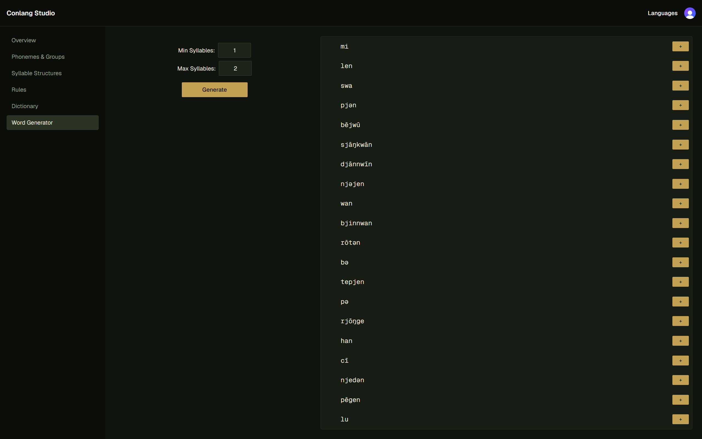
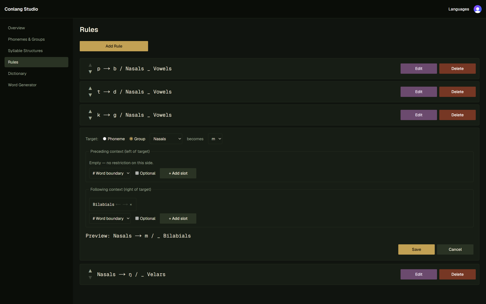
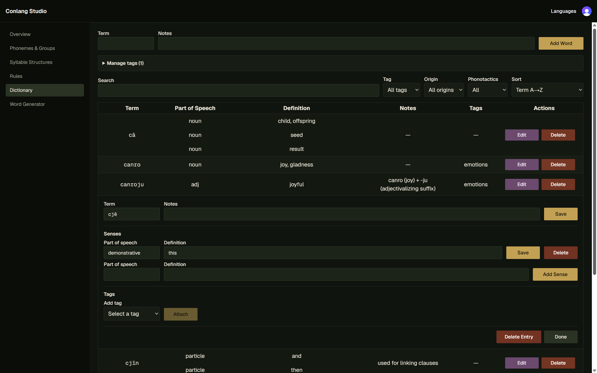

# Conlang Studio

A web app for designing constructed languages end to end: define a phoneme
inventory, group sounds, describe syllable shapes, write sound-change rules,
and generate vocabulary that follows them — then track it all in a
per-language dictionary.

Live at [conlang-app.vercel.app](https://conlang-app.vercel.app/). The
day-by-day build process is written up in [DEVLOG.md](DEVLOG.md).



## Features

- **Phonemes & groups** — build a language's sound inventory (symbol,
  optional IPA notation, generation weight) and organize sounds into named,
  reusable groups (e.g. "vowels", "stops").
- **Syllable structures** — weighted templates built from phonemes and/or
  phoneme groups, describing the valid syllable shapes for a language.
- **Rules** — ordered phonological rewrite rules: a target phoneme or group
  mutates into a different phoneme when surrounding left/right context
  matches. Applied in sequence during generation.
- **Word generator** — samples syllable structures (and phoneme/group weights
  within them) to produce candidate words within a syllable-count range, runs
  them through the rule pipeline, and lets you bank results straight into the
  dictionary.
- **Dictionary** — lexemes with notes and an origin flag (generated vs.
  hand-typed), each with any number of senses (part of speech + definition),
  free-form tags, and full-text search/sort across terms, senses, notes, and
  tags.
- **Phonotactics checker** — validates a word against every syllable template
  in a language (expanding optional slots), for hand-typed entries that
  aren't guaranteed to fit the rules.
- **Public demo language** — a single language can be flagged `is_public` so
  anonymous visitors can open it read-only (browse phonemes/rules, run the
  word generator) straight from the "Try the demo" link on the landing page,
  no sign-in required. Mutation controls simply don't render for a
  non-owner; every other language stays private to its owner.

Every feature above is exposed both through the app's UI and through a
matching set of authenticated HTTP API routes under `/api/languages/[id]/...`
(see [Architecture](#architecture)).

### Screenshots

|                                             Rules editor                                             |                                      Dictionary                                       |
| :--------------------------------------------------------------------------------------------------: | :-----------------------------------------------------------------------------------: |
|  |  |

## Tech stack

- [Next.js 16](https://nextjs.org/) (App Router, Server Components, Server
  Actions) + React 19 + TypeScript
- [Clerk](https://clerk.com/) for authentication
- [Neon](https://neon.tech/) (serverless Postgres) + [Drizzle
  ORM](https://orm.drizzle.team/) for the database
- [Zod](https://zod.dev/) for input validation
- [Tailwind CSS](https://tailwindcss.com/) + [shadcn/ui](https://ui.shadcn.com/)
  (Radix primitives, `cva` variants) for styling
- [Vitest](https://vitest.dev/) for unit tests, [Playwright](https://playwright.dev/)
  for end-to-end tests

## Getting started

Requires a [Neon](https://neon.tech/) Postgres database and a
[Clerk](https://clerk.com/) application.

1. Install dependencies:

   ```bash
   npm install
   ```

2. Create a `.env` file in the project root with:

   ```bash
   DATABASE_URL=                # Neon connection string

   NEXT_PUBLIC_CLERK_PUBLISHABLE_KEY=
   CLERK_SECRET_KEY=
   NEXT_PUBLIC_CLERK_SIGN_IN_URL=/sign-in
   NEXT_PUBLIC_CLERK_SIGN_UP_URL=/sign-up
   NEXT_PUBLIC_CLERK_SIGN_IN_FALLBACK_REDIRECT_URL=/languages
   NEXT_PUBLIC_CLERK_SIGN_UP_FALLBACK_REDIRECT_URL=/languages

   # Optional: a Clerk test user (`+clerk_test` email) for exercising
   # auth-gated flows without real email verification.
   CLERK_TEST_USER_EMAIL=
   CLERK_TEST_USER_PASSWORD=

   # Optional: id of a language with `is_public = true`, powering the
   # "Try the demo" link on the landing page for signed-out visitors.
   NEXT_PUBLIC_DEMO_LANGUAGE_ID=
   ```

3. Apply migrations to your database (see [Database](#database)):

   ```bash
   npm run db:migrate
   ```

4. Start the dev server:

   ```bash
   npm run dev
   ```

   Open [http://localhost:3000](http://localhost:3000).

## Commands

| Command               | Purpose                                                        |
| --------------------- | -------------------------------------------------------------- |
| `npm run dev`         | Dev server at http://localhost:3000                            |
| `npm run build`       | Production build                                               |
| `npm run typecheck`   | Whole-project type check (`tsc --noEmit`); stricter than `build`, which only checks files reachable from routes |
| `npm run test:run`    | Vitest, single pass (`npm test` runs in watch mode)            |
| `npm run test:e2e`    | Playwright end-to-end tests against a running dev server (not run in CI — single shared test account/DB) |
| `npm run lint`        | ESLint                                                         |
| `npm run db:generate` | Generate a migration from schema changes in `app/db/schema.ts` |
| `npm run db:migrate`  | Apply pending migrations to the database                       |

## Architecture

Route handlers, Server Actions, and Server Components are thin adapters over
a shared **service layer**. Each operation is implemented once in
`app/lib/<feature>.ts` (`createLanguageSvc`, `deletePhonemeSvc`, ...), which
takes an already-resolved user and raw input, validates it, enforces
ownership, performs the DB operation, and returns a `Result` — never
throwing for expected failures. Server Actions and API routes both call the
same service function, so behavior never drifts between the two entry
points.

```
app/
├── db/                    # schema.ts (Drizzle tables + relations),
│                          #   validation.ts (Zod schemas), json-shapes.ts
│                          #   (jsonb payload types: syllable templates, rule contexts)
├── lib/                   # service layer: one file per feature, plus
│                          #   shared helpers (result.ts, parse.ts, ownership.ts, http.ts)
│                          #   and pure, unit-tested domain logic (wordgen.ts,
│                          #   phonotactics.ts, rule-apply.ts)
├── api/languages/[id]/... # HTTP route adapters
└── languages/[id]/...     # Server Components + Server Actions + client UI,
                            #   one subroute per feature (phonemes, syllables,
                            #   rules, dictionary, wordgen)
```

Full conventions (naming, the `Result` type, ownership rules, JSDoc
expectations) are documented in `CLAUDE.md`.

## Database

Schema changes go through committed migrations in `drizzle/`: run
`npm run db:generate` after editing `app/db/schema.ts` to produce a migration
file, then `npm run db:migrate` to apply it to Neon.
